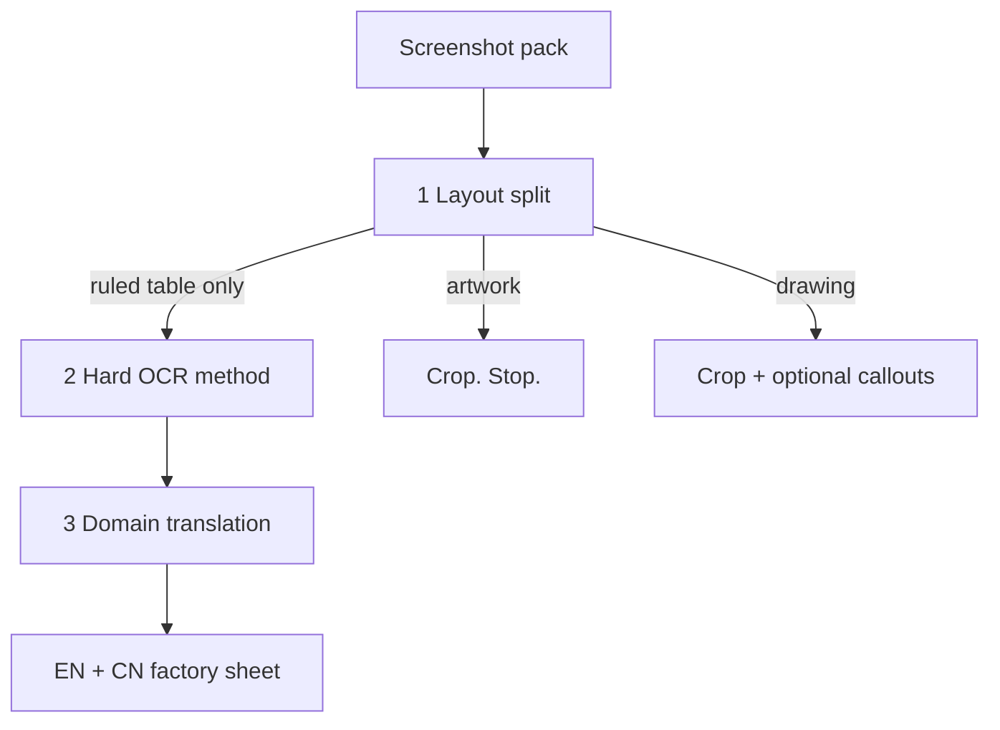
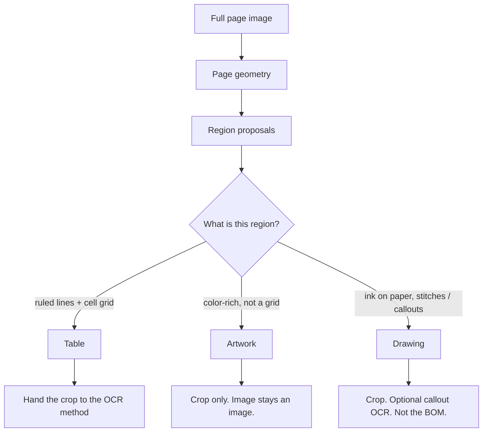
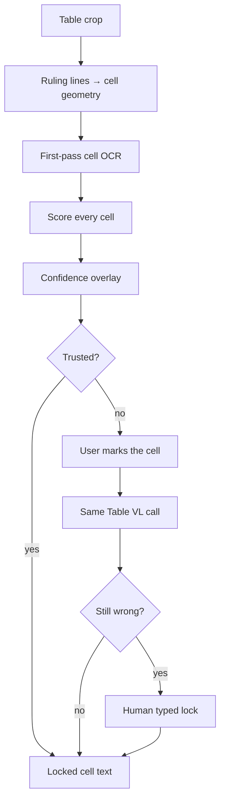
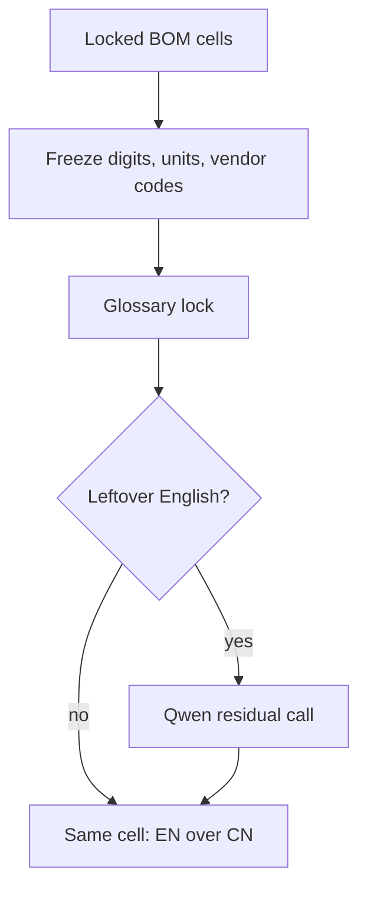

# Path to a factory-ready tech pack

The live demo is a **first-pass result**. This page is the considered path: why a screenshot pack fails if you treat it as one model, and how three pipelines in a fixed order get to a factory sheet.

A fashion tech pack that is a **PNG inside a PDF** has no PDF text tokens. There is no reliable extract-then-translate. The page is an image of three different products sitting next to each other:

1. a **ruled BOM table** (text is the product)
2. a **color artwork** (pixels are the product)
3. a **line drawing** with stitch callouts (geometry is the product; a few labels are text)

Sending the whole page through OCR, or through a translator, or through a layout model alone, mixes those products. The strength of this solution is that it **does not**.

The three cells stay the same size. **Mark → rescan** sits as a loop on top of Ruled table only.

Order is the method. Wrong region first makes every later stage invent work.

| Pipeline | Strength | What must not happen |
|---|---|---|
| **1. Layout / segmentation** | Three exclusive regions, interchangeable detector | Artwork sent to OCR; table treated as a picture |
| **2. Difficult OCR** | One method for unbounded outliers | A catalog of failure cases; a second whole-page pass |
| **3. Domain translation** | Glossary and freezes before any model | An LLM rewriting `YKK: 316`, `97%`, or `DTM` |

Diagrams below can be drawn in more detail later. The live demo does not yet run pipelines 2 and 3 in full; it already shows pipeline 1 and the glossary lock from pipeline 3.

---

## 1. Reliable layout / segmentation

**Job.** Decide *what kind of thing* each region is, before anyone reads a glyph.

**Why this is the first strength.** On a screenshot pack the hard error is not a missed word. It is applying the wrong tool. OCR on artwork hallucinates letters in paint. A generic “document parse” on a line drawing flattens stitches into paragraphs. A table detector that only looks for text misses ruling lines that *are* the spreadsheet.

**Considered path.**

Rules that make this reliable:

- **Split before read.** Layout is a geometry problem. Libraries are interchangeable (Docling today; another detector tomorrow). The contract is three boxes, not a vendor.
- **Artwork never enters the text path.** No OCR, no confidence map, no translation. Colorway is the deliverable.
- **Drawing is not a BOM.** Stitch labels may be read later. They do not go through the factory glossary.
- **The table is a grid first.** Ruling lines define cells. Text is filled *into* those cells. We do not infer columns from reading order.

The current demo already shows this split: red = table, blue = artwork, teal = drawing.

---

## 2. Difficult OCR cases

**Job.** Get trustworthy text *per cell* on a ruled table whose failures cannot be listed in advance.

**Why this is the second strength.** Table OCR is an open-ended problem: watermark through a glyph, tiny type, a header that spans two rules, a digit that looks like `O`, a cell that reads the neighbor, skew, a faint line that splits a word. Those are not a product checklist. Any list you publish becomes the next miss.

**Considered path — one method, not a case list.**

What “success” means here:

- **Geometry is cheap and structural.** The grid comes from ruling lines. A wrong glyph does not move the cell.
- **Uncertainty is a surface, not a taxonomy.** Green → red on the same cells the factory will read. The user marks what looks wrong, including silent blanks.
- **Rescan is the same call.** Marked cell (or the table crop) goes to a **Table VL** inference call (`promptLabel: table`) on a **local** service. On a Mac that process is Foundation Models + Core ML. Same body for first hard pass and for Mark → rescan. No second product.
- **Typed lock is last, not first.** A human freezes a cell only after the service is still wrong.
- **Artwork and drawing stay out of this loop.**

This repo does not host that model and does not wire the call. The live demo’s table is still first-pass Vision + line-grid. The diagram is the path; the HTTP shape lives in [ARCHITECTURE.md](ARCHITECTURE.md).

---

## 3. Ruled table translation with domain knowledge

**Job.** Same cells, English over Simplified Chinese, without breaking factory tokens.

**Why this is the third strength.** A general translator will “helpfully” rewrite the things a factory must not lose: `97%`, `5.5 oz`, `60"`, `#5`, `YKK: 316`, `N/A`, `DTM`, `CB`. Those are not prose. They are the order.

**Considered path — lock the domain, then ask a model only for leftovers.**

What “success” means here:

- **Glossary first, in-process.** Deterministic replace before any model: `DTM` → 同色配线, `CB` → 后中, `Swift Tack` → 打枪条, `Poplin` → 府绸. The list is data (`glossary_en_zh.json`), not prompt text.
- **Freeze before replace.** Spans matching digits, units, and vendor codes are copied through unchanged. The model never sees them.
- **Residual only.** Leftover English is a **Qwen** chat call to the **same** local inference service as Table VL. Cloud is optional and off. The model is not in this repo; the call is architectural.
- **Same grid.** Translation does not reflow columns. Artwork is not translated. Drawing callouts are not sent through the BOM glossary.

On the sample pack the glossary lock already finishes the sheet: **119 hits, 32 frozen spans, 0 leftover English**. Residual Qwen is there for the next pack that has prose the glossary does not know.

---

## Built now vs the path

| Piece | In the live demo | On the path |
|---|---|---|
| Layout split → table / artwork / drawing | Yes | Same contract; detector interchangeable |
| Artwork crop only | Yes | Stays crop only |
| Ruled grid + first-pass cell OCR | Yes (Vision / line-grid; header still imperfect) | First pass remains; hard cells go to Table VL |
| Confidence overlay + mark → rescan | No | Next table-QA surface |
| Table VL call | No (architectural) | Local service; Mac Foundation Models + Core ML |
| Glossary lock + freeze + EN/CN sheet | Yes | Same; VN / TH glossaries later |
| Residual Qwen call | No (architectural) | Same local service; leftover prose only |

Call contracts and the module diagram: [ARCHITECTURE.md](ARCHITECTURE.md).
