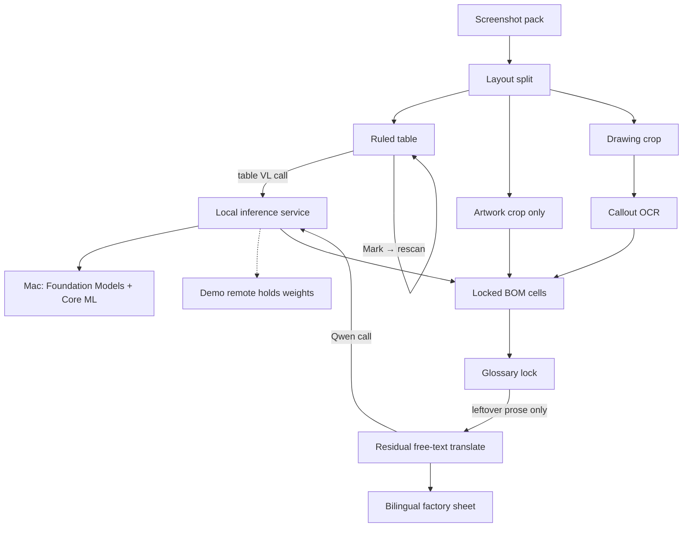

# Tech-pack pipeline — architecture

Functional modules only. Implementation libraries are interchangeable.

This pipeline is for a **screenshot-style** pack: one spec table, one color artwork, one line drawing.

## Main line



Artwork and drawing do not use this OCR-confidence loop. Table text does.

## Ruled table: Table VL service, not a case list

Table OCR is a **hard, open-ended** problem. Failures are not a closed list. Architecturally the method is one inference call with `promptLabel: "table"` on the table crop (or on a marked cell). Same body for first pass and for **Mark → rescan**.

This repo does **not** host that model and does **not** wire the call. The pattern is the JSON the PaddleOCR-VL 1.6 Space uses for element-level Table Recognition. Preferred runtime is a **local** inference service. On a Mac that process is Foundation Models + Core ML. The Space only shows how the call looks; weights stay there.

```http
POST /layout-parsing
Content-Type: application/json

{
  "file": "<png base64>",
  "fileType": 1,
  "matchHistoryJob": false,
  "useLayoutDetection": false,
  "promptLabel": "table",
  "useDocUnwarping": false,
  "useDocOrientationClassify": false
}
```

Human **typed lock** remains last if the service is still wrong. Then glossary / translation.

## Residual Qwen: same call pattern

Leftover English after glossary lock is not a second product. It is the same **local inference service**, a chat call instead of a table crop. This repo does **not** host Qwen and does **not** wire that call. On a Mac the process is Foundation Models + Core ML. The model stays outside; we only show the request.

```http
POST /v1/chat/completions
Content-Type: application/json

{
  "model": "qwen",
  "temperature": 0,
  "messages": [
    {
      "role": "user",
      "content": "Translate this garment-factory BOM phrase into Simplified Chinese. Copy frozen tokens unchanged. Reply with only the translation.\n\n<leftover phrase>"
    }
  ]
}
```

Glossary lock still runs first in-process. Digits, units, and vendor codes never enter this call. Cloud is optional and off.

## Other stages

**Layout split** — table, artwork, drawing.

**Artwork** — crop only. No OCR, no confidence map, no translation.

**Drawing** — crop plus stitch/callout text. Not sent through the BOM glossary.

**Glossary lock** — deterministic replace before any model (`DTM` → 同色配线, `CB` → 后中, `Swift Tack` → 打枪条). Digits, units, and vendor codes (`97%`, `5.5 oz`, `YKK: 316`, `#5`) are frozen.

**Residual translate** — leftover English only, as a Qwen-shaped chat call to the same local inference service. Architectural; not wired. Frozen tokens unchanged. Same grid. EN + CN.

## Built vs next

| Stage | Status |
|---|---|
| Ingest, layout split, artwork crop, drawing callouts | Built |
| Ruled table → viewable HTML grid | Built; header imperfect; first pass still Vision/line-grid |
| Table VL inference call | Architectural only — not wired |
| Residual Qwen call | Architectural only — not wired |
| Glossary lock + bilingual factory sheet | Built (EN→CN); leftover prose has nowhere to go until the Qwen call is wired |
| Cell confidence overlay + mark → Table VL rescan | Later |
| VN / TH glossaries | Later |
