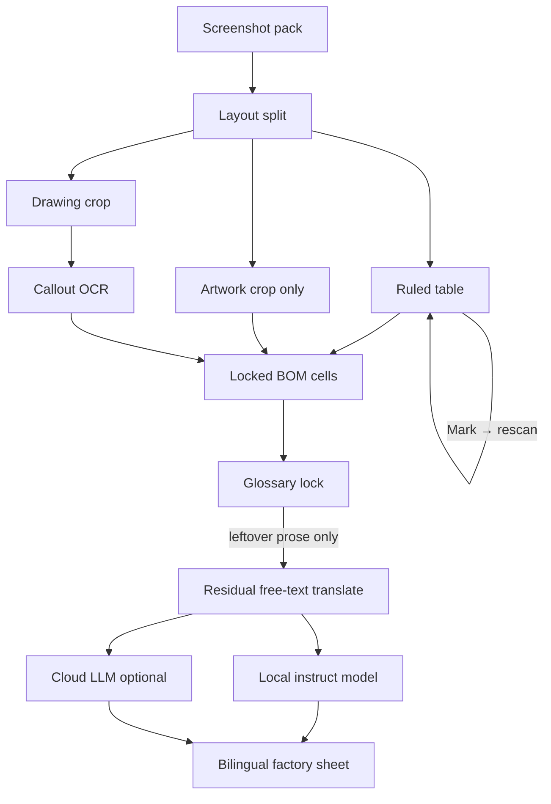

# Tech-pack pipeline — architecture

Functional modules only. Implementation libraries are interchangeable.

This pipeline is for a **screenshot-style** pack: one spec table, one color artwork, one line drawing.

## Main line

Artwork and drawing do not use this OCR-confidence loop. Table text does.

## Ruled table: one method for unbounded OCR outliers

Table OCR is a **hard, open-ended** problem. Failures are not a closed list (cross-line reading, font/size splits, watermarks, skew, small type, …). A single pass still emits one text per cell, so any miss becomes a hard error.

The method is the same for every outlier: **score → review → mark → rescan → typed lock**. Do not enumerate cases in the product flow.

**Confidence-guided HITL rescan** (cell-local):

1. **Score every cell.** Overlay the grid green (high) → red (low). Surface uncertainty, not a taxonomy of defects.
2. **User marks** cells that look wrong, including silent blanks.
3. **Rescan marks only** with a stronger cell pass (scale, contrast, geometry). Do not rerun the whole page unless layout failed.
4. **Typed lock last** if rescan is still wrong. That cell is frozen.
5. **Then** locked cells go to glossary / translation. Unverified low-confidence cells do not.

The overlay is the product surface. Auto-fix without a mark is out of scope.

## Other stages

**Layout split** — table, artwork, drawing.

**Artwork** — crop only. No OCR, no confidence map, no translation.

**Drawing** — crop plus stitch/callout text. Not sent through the BOM glossary.

**Glossary lock** — deterministic replace before any model (`DTM` → 同色配线, `CB` → 后中, `Swift Tack` → 打枪条). Digits, units, and vendor codes (`97%`, `5.5 oz`, `YKK: 316`, `#5`) are frozen.

**Residual translate** — model sees only leftover English. Local instruct model if one is already serving; cloud LLM optional and off by default. Same grid. EN + CN. Frozen tokens unchanged.

## Built vs next

| Stage | Status |
|---|---|
| Ingest, layout split, artwork crop, drawing callouts | Built |
| Ruled table → viewable HTML grid | Built; header imperfect; OCR still a single-pass guess |
| Glossary lock + bilingual factory sheet | Built (EN→CN); residual waits for a local model |
| Cell confidence overlay + mark + targeted rescan | Next table QA |
| VN / TH glossaries | Later |
