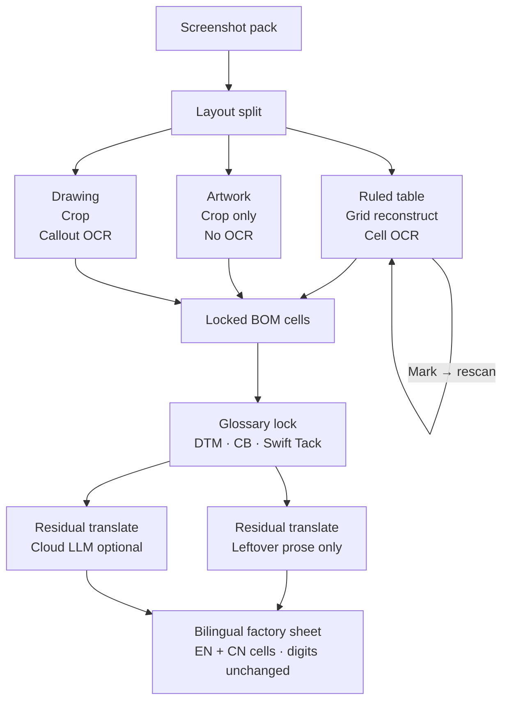
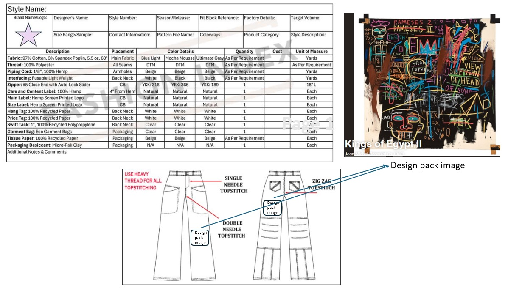
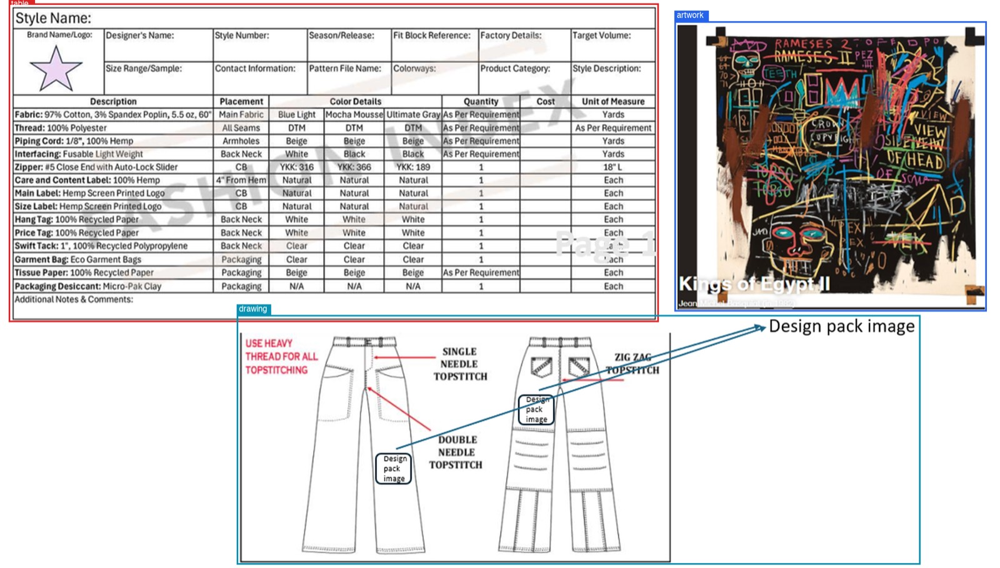
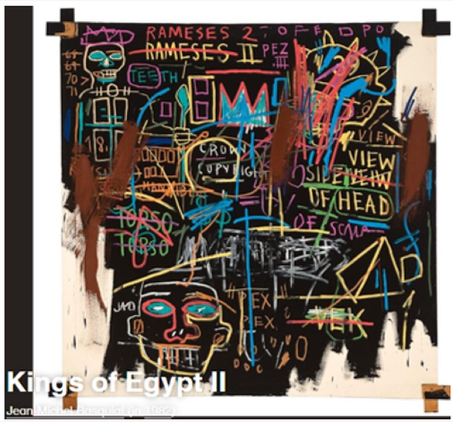
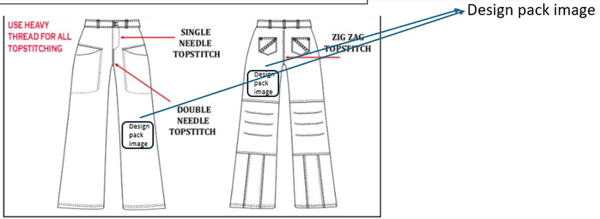

# Tech-pack document pipeline

One **screenshot-style** fashion tech pack in. A ruled BOM spreadsheet, an artwork crop, a drawing crop, and an **EN + CN factory sheet** out. Runs locally. No cloud API required.



The three cells stay the same size. **Mark → rescan** sits as a loop on top of Ruled table only.

Live demo: [jiefengcheng.github.io/techpack-doc-pipeline](https://jiefengcheng.github.io/techpack-doc-pipeline/). Considered path (layout, hard OCR, domain translation): [APPROACH.md](APPROACH.md) · [live diagrams](https://jiefengcheng.github.io/techpack-doc-pipeline/approach.html). Spreadsheet: [table_bilingual.html](https://jiefengcheng.github.io/techpack-doc-pipeline/table_bilingual.html).

---

## What it does

A tech pack that is a **PNG inside a PDF** (or a plain screenshot) has no PDF text tokens. This pipeline treats the page as an image:

| Region | What happens |
|---|---|
| **Ruled table** | Reconstruct a viewable HTML grid from ruling lines + OCR, then glossary-lock English → Simplified Chinese in the same cells |
| **Artwork** | Crop only. Never OCR. Never translate. |
| **Drawing** | Crop. Optional stitch/callout OCR. Not sent through the BOM glossary. |

Glossary lock is deterministic and runs **before** any model: `DTM` → 同色配线, `CB` → 后中, `Swift Tack` → 打枪条. Digits, units, and vendor codes stay frozen (`97%`, `5.5 oz`, `60"`, `#5`, `YKK: 316`, `N/A`). Leftover prose is a Qwen call on the same local inference service (architectural, not wired).

Leftover prose after glossary lock is the same pattern: a Qwen chat call to that local service, not a model in this repo.

## Demo result

Input (screenshot pack):



Layout split:



| Artwork (crop only) | Drawing |
|---|---|
|  |  |

Bilingual factory sheet (English over Chinese in each cell): [open the live grid](https://jiefengcheng.github.io/techpack-doc-pipeline/table_bilingual.html).

Examples from that grid:

- `Fabric: 97% Cotton, 3% Spandex Poplin, 5.5 oz, 60"` → `面料: 97% 棉, 3% 氨纶 府绸, 5.5 oz, 60"`
- `Thread` / `DTM` → `车缝线` / `同色配线`
- `Zipper: #5 Close End with Auto-Lock Slider` at `CB` with `YKK: 316` → `拉链: #5 闭尾自动锁拉链头` / `后中` / `YKK: 316`
- `Swift Tack: 1", 100% Recycled Polypropylene` → `打枪条: 1", 100% 再生聚丙烯`

## Run it

Needs Python 3.11–3.13. On macOS, cell OCR uses Apple Vision.

```bash
git clone git@github.com:jiefengcheng/techpack-doc-pipeline.git
cd techpack-doc-pipeline
uv sync --python 3.12
uv run techpack docs/sample/techpack.png
```

Writes `runs/techpack/`: overlay, table HTML, bilingual sheet, artwork crop, drawing crop.

Translate a saved table without re-running layout:

```bash
uv run techpack --localize-html runs/techpack/table.html --no-residual
```

Local Gradio UI on [http://localhost:7861](http://localhost:7861):

```bash
uv run techpack --ui
```

`--no-translate` skips localization. Extend factory terms in [`src/techpack_pipeline/data/glossary_en_zh.json`](src/techpack_pipeline/data/glossary_en_zh.json).

## Honest limits

- Built for **one table + one artwork + one drawing** on a screenshot pack, not a native-text PDF.
- Table OCR first pass is line-grid + Vision. Hard cells are an architectural Table VL call (`promptLabel: table`) to a local inference service (Mac: Foundation Models + Core ML). Residual leftover English is a Qwen chat call to the same service. Neither call is wired in this repo.

Conceptual pipelines and the path to success: [APPROACH.md](APPROACH.md). Module contracts: [ARCHITECTURE.md](ARCHITECTURE.md).
